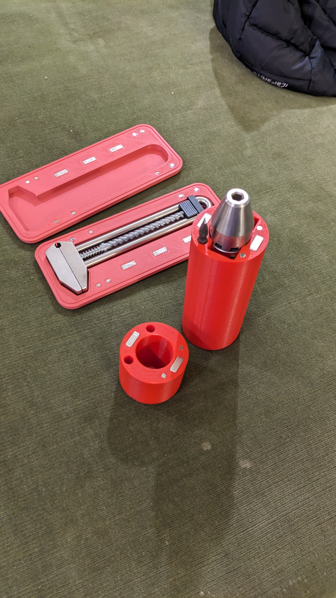

#Metmo 3d printed cases

By designing these cases as a fun project, I was able to learn the ins and outs of 3D modeling for printing. It was a great way to exercise my creativity and gain valuable skills in a new technology.3d models:
driver case:https://collaborate.shapr3d.com/v/x_RzPMHDT7ZXdtBdDrrMY

grip case:https://collaborate.shapr3d.com/v/zHcVzic2rmKiWOqOTxSwe

### Magnets for Metmo 3d printed cases:

[**Neodymium Magnet 15x6x3mm**](https://gb9vn.app.goo.gl/3bpZ "**Neodymium Magnet 15x6x3mm**")
[**Neodymium Magnet 4x2mm**](https://gb9vn.app.goo.gl/B6Jt "**Neodymium Magnet 4x2mm**")

###Images:

